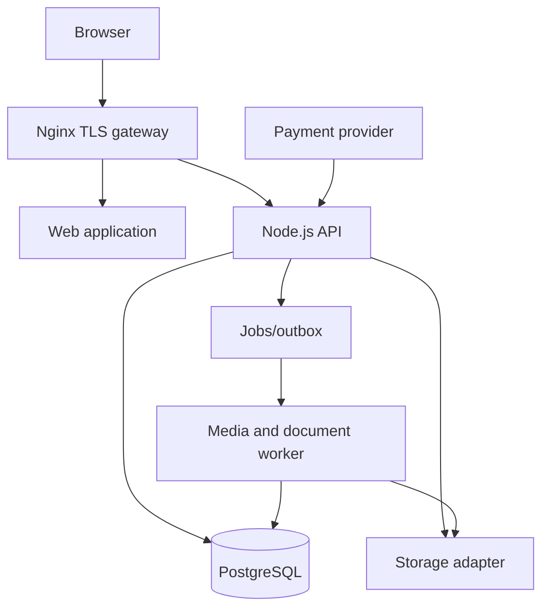

# Architecture and media

## Components

Use modular monolith boundaries: identity; catalog/content; enrollment/entitlements; learning/progress; assessments; billing; certificates; media; analytics. PostgreSQL transactions enforce key invariants. Start with PostgreSQL-backed jobs/outbox and a dedicated worker; introduce a separate queue if measured throughput warrants it. Avoid distributed transactions between database and provider.

Use Node.js LTS/Express or a minimal equivalent, SQL migrations, runtime schema validation, and explicit service interfaces. Prefer plain HTML/CSS/JS and progressive enhancement. Code identifiers/comments in English and JavaScript camelCase. Lock dependency versions and document supported versions when implementation begins.

## Video lifecycle

Upload authorization → private quarantine → size/type inspection and malware scanning → ffprobe validation → FFmpeg encoding → poster and captions/transcript association → READY. A failed job stays FAILED with a retry count and human-readable status. Originals are retained by policy, never served directly from public web roots. Publish only READY media. Generate HLS renditions (for example 360p/720p with source-dependent caps) and progressive MP4 fallback if justified by client tests. Preserve captions as WebVTT, plus downloadable transcript and language metadata. Media processing happens off the API request path.

Public courses can serve public media through cached paths. Paid/private assets use an authorized short-lived playback session and segment access control; do not place long-lived bearer credentials in public manifests, logs or referer URLs. Validate authorization for playlists, segments, keys and attachments. HLS tokens limit casual sharing, not screen capture. CDN/object storage is an adapter option; local disk is acceptable at small scale with measured uplink capacity, disk headroom and backups. Storage interface: putPrivate, readAuthorized, delete, generateDeliveryGrant, stat.

Serving video via Maia Edge requires a load test with realistic concurrent viewers and bitrate. Approximate outbound demand: viewers × average bitrate, plus protocol overhead; e.g. 100 viewers × 2 Mb/s already approaches 200 Mb/s before overhead. A VPS gateway or home uplink must be tested before paid launch.

## Interfaces

PaymentProvider: createCheckout, getPayment, verifyWebhook, refund, normalizeEvent. StorageProvider and EmailProvider are separate ports. Avoid translating provider events directly into enrollment state without normalized order state transitions. Optional future CourseAssistant port can index consented course assets in Maia RAG and surface cited answers through Maia Chat, with per-course access checks.

## Reliability

Health endpoints distinguish liveness and readiness. Timeouts/retries with backoff around external calls; idempotent workers and webhook consumers; transactional outbox for notifications and certificate jobs. Structured logs include correlation IDs but redact tokens and personal/payment data. Backups and restore drills cover database and media together. See operations.
