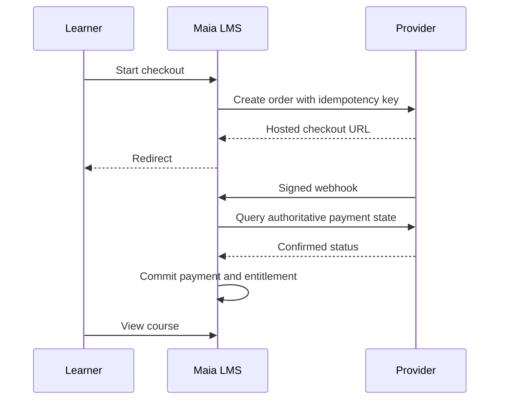

# Payments and entitlement

> **Initial MVP status:** this document records requirements for the complete product. The initial MVP delivered free text courses, identity, enrollment, and progress. Video, commerce, quizzes, certificates, MFA, and privacy requests still required implementation at that stage. See [the roadmap](09-roadmap.md) for subsequent deliveries.

## Initial implementation

Implement Mercado Pago hosted Checkout Pro first, with Pix availability verified for the merchant account and checkout configuration. Add PayPal through the same PaymentProvider contract after first release; PagBank/PagSeguro is a later adapter. Provider support, country, fees and settlement terms must be confirmed against the account before launch. Hosted checkout reduces payment-data exposure. Never process card numbers in Maia LMS.

## State machine

Order: CREATED → CHECKOUT_PENDING → PAID / EXPIRED / CANCELED; PAID → PARTIALLY_REFUNDED / REFUNDED / CHARGEBACK. A late or repeated notification reconciles against provider state; invalid backward transitions are logged for review. One course order captures immutable price, currency, account and promotion snapshot. Enrollment grant is based on confirmed provider capture/approved payment, not browser redirect, callback claims, or mere order approval.

Persist provider event ID and raw payload reference; verify webhook signature using provider-specific documented method and raw body, apply rate limits, then fetch authoritative state if required. Acknowledge fast and process idempotently. Reconciliation job checks pending and recently paid orders for missed webhooks and mismatches. Provider retries must not duplicate grants. Handle payment pending (especially Pix), expiry, duplicate checkout attempts, partial refunds, disputes and delayed reversals. Alert on unprocessed events and paid-without-entitlement cases.

Use provider-required idempotency headers for create/refund with stable per-attempt keys; never regenerate the key for a network retry of the same operation. Keep secret keys server-side and rotate them. Separate sandbox and production credentials and webhook endpoints.

## Commerce policy to publish before charging

Display price/currency, taxes where applicable, scope and duration of access, refund/cancellation terms, support contact, company identity, privacy notice and certificate conditions. Implement locale-aware invoices/receipts according to accounting/legal advice; do not assume a payment receipt substitutes for a Brazilian nota fiscal. Obtain legal review of consumer rules and LGPD handling before launch.

## Official integration references (checked September 2026)

- Mercado Pago Checkout Pro orders: https://www.mercadopago.com.br/developers/en/docs/checkout-pro-orders/create-order
- Mercado Pago notifications and signature verification: https://www.mercadopago.com.br/developers/en/docs/checkout-pro-orders/notifications
- Mercado Pago Pix and idempotency: https://www.mercadopago.com.br/developers/pt/docs/checkout-api-orders/payment-integration/pix
- PayPal checkout webhooks: https://developer.paypal.com/payment-methods/webhooks/

Provider API details must be rechecked during implementation because integrations evolve.
